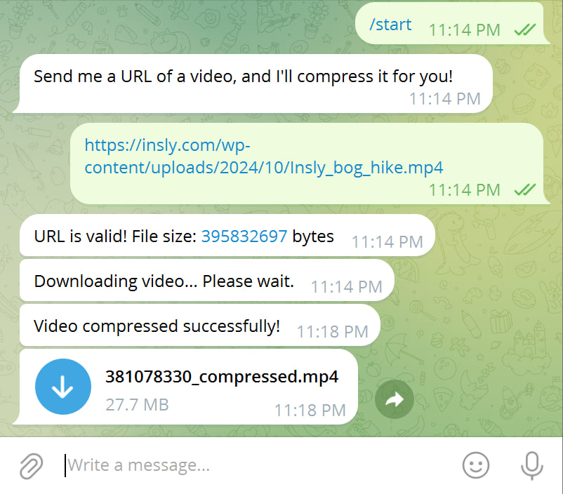
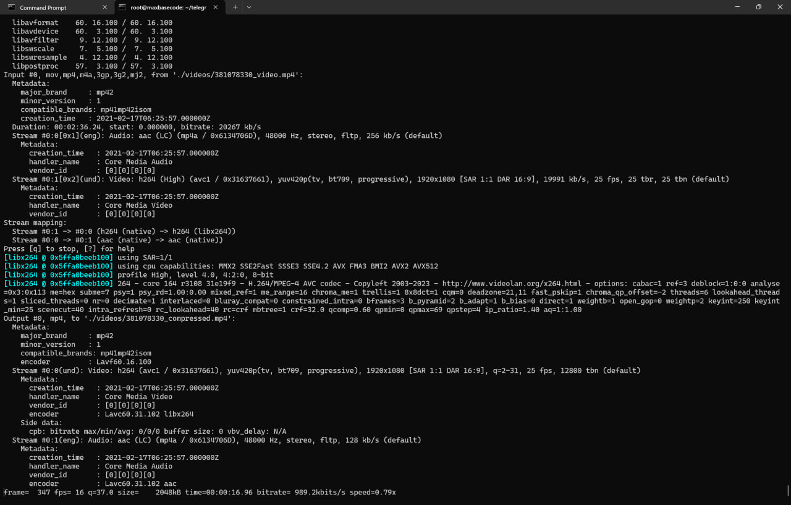

# Telegram Video Compressor Bot (telegram-video-compressor)

A Telegram bot that validates video URLs, downloads the videos, compresses them using FFMPEG, and shares the compressed video back with the user.  

## Features

- Validates user-submitted URLs to ensure they are valid and accessible.
- Checks if the URL returns a 200 HTTP status code (no 404 or invalid URLs).
- Retrieves file metadata, such as video size, without downloading the video.
- Downloads the video in the background.
- Compresses the video using FFMPEG with efficient settings (`libx264`, `crf 32`).
- Sends the compressed video back to the user as a downloadable file.

## Reduce 377 MB Video to Just 27 MB in Minutes with This Fast Telegram Bot!





## Installation

1. Clone the repository:

   ```bash
   git clone https://github.com/basemax/telegram-video-compressor.git
   cd telegram-video-compressor
   ```

2. Install the required Python packages:

   ```bash
   pip install -r requirements.txt
   ```

3. Install FFMPEG on your system:

   ```bash
   sudo apt update
   sudo apt install ffmpeg
   ```

4. Set up your bot token:

Obtain a bot token from **BotFather** on Telegram.

Replace `YOUR_BOT_TOKEN` in the `main.py` script with your actual bot token.

## Usage

Start the bot:

```bash
python main.py
```

Send a video URL to the bot in Telegram.

The bot will:
- Validate the URL.
- Download the video.
- Compress the video using FFMPEG.
- Send the compressed video back to you.

## Example

User sends:

```
https://example.com/video.mp4
```


Bot responds:

```
✅ URL is valid!
🔄 Downloading video...
🗜️ Compressing video...
📤 Sending compressed video...
```

## Requirements

- Python 3.7+
- requests Python library
- python-telegram-bot library
- FFMPEG installed on your system

## License

This project is licensed under the MIT License. See the LICENSE file for details.

## Contributing

Contributions are welcome! Please fork this repository and submit a pull request with your changes.

## Contact

Feel free to reach out for any questions or suggestions: **@basemax**

Copyright 2024, Max Base
